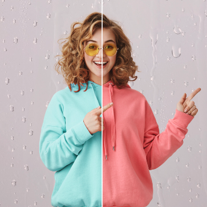

<!--
This README describes the package. If you publish this package to pub.dev,
this README's contents appear on the landing page for your package.

For information about how to write a good package README, see the guide for
[writing package pages](https://dart.dev/tools/pub/writing-package-pages).

For general information about developing packages, see the Dart guide for
[creating packages](https://dart.dev/guides/libraries/create-packages)
and the Flutter guide for
[developing packages and plugins](https://flutter.dev/to/develop-packages).
-->

# CompareImageSlider

The `CompareImageSlider` package is a Flutter widget that provides an interactive image comparison slider. It allows users to compare two images by dragging a slider horizontally, revealing portions of the before and after images seamlessly.


## Features

- Allows users to compare "before" and "after" images by dragging a slider horizontally.
- Set the starting position of the slider (from 0.0 to 1.0) to determine how much of each image is initially visible.
- Provides a smooth and intuitive user experience for adjusting the slider position in real-time.
- Efficient rendering with CustomClipper ensures smooth performance for various screen sizes.
- Works with AssetImage, NetworkImage, or any other ImageProvider.
- Automatically adapts to different screen sizes and orientations, making it ideal for mobile and tablet apps.


#### AWESOME RATING



# Installing

### 1. Depend on it

Add this to your package's `pubspec.yaml` file:

```yaml
dependencies:
  compare_image_slider: ^0.0.1
```

### 2. Install it

You can install packages from the command line:

with `pub`:

```
$ pub get
```

with `Flutter`:

```
$ flutter pub get
```

### 3. Import it

Now in your `Dart` code, you can use:


```dart
import 'package:compare_image_slider/compare_image_slider.dart';
```


## Usage

```

import 'package:compare_image_slider/compare_image_slider.dart';

class MyWidget extends StatelessWidget {
   @override
   Widget build(BuildContext context) {
      return SizedBox(
              height: 500,
              child: CompareImageSlider(
                beforeImage: AssetImage('assets/images/image1.png'),
                afterImage: AssetImage('assets/images/image2.png'),
                initialPosition: 0.5, // Start in the middle
                sliderColor: Colors.white,
                sliderThickness: 2.0,
              ),
            );
   }
}

```

## Customization
- Initial Slider Position
    => Use the initialPosition property to set the starting position of the slider.
    => Accepts a value between 0.0 (fully showing the "before" image) and 1.0 (fully showing the "after" image).
- Slider Color
    => Customize the slider's color using the sliderColor property to match your app's theme.
- Slider Thickness
    => Adjust the thickness of the slider using the sliderThickness property.
- Image Sources
    => Use any ImageProvider (e.g., AssetImage, NetworkImage, MemoryImage) for the beforeImage and afterImage.


## Contributions
Feel free to contribute to this project by submitting a pull request or opening an issue.
